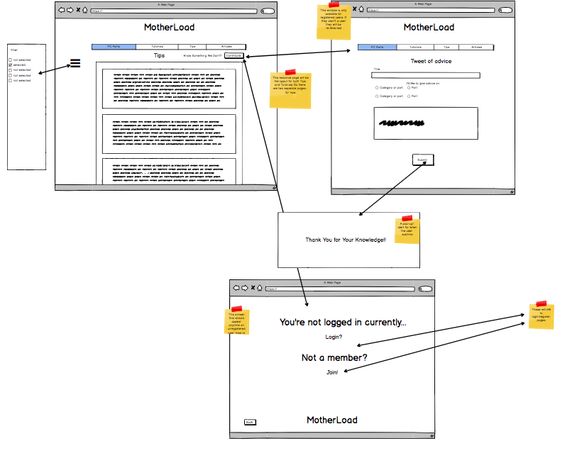
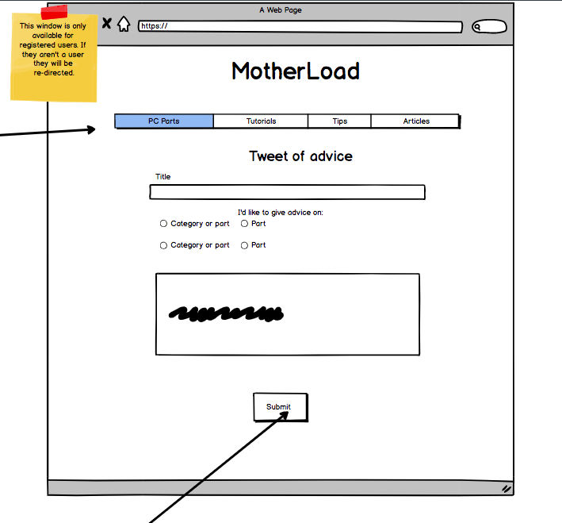
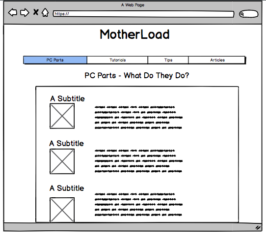

# MotherLoad


The focuse of this app is to provide accesible and easy to understand knowledge around building a PC. Looking at the parts themselves and tips, tutorials and any relevant articles. But also having a place where people can share what they have learnt in their build journey. 


## The Tech

* [React](https://reactjs.org/docs/getting-started.html)
* [Redux](https://redux.js.org/)
* [Express](https://expressjs.com/en/api.html)
* [Knex.js (SQL)](https://knexjs.org/)
* [JWT Auth (Local)](https://jwt.io/)


## User Stories

### MVP

As a non-registered user:
  * I want to register for the App under my name.
  * I want to browse tips, tutorials, articles and other knowledge.
  * I want to have access to information that matches my knowledge.
  * I want access to tools to build my pc and ask for more advanced help.

As a registered user:
  * I want to save tips, tutorials to find them again easily.
  * Be able to post tweets of advice (tips/tutorials).

### Stretch

As a registered user:
  * Have forum where I can ask for help, advice or trouble shoot and have people respond.

  ---

## Views (Client Side)
  | name | purpose |
  | --- | --- |
  | Login | View for user to enter their login credentials |
  | Register | View for user to sign up for the App |
  | Tips | View all the tips |
  | Tutorials| View all recommended tutorials |
  | Articles | View relevant articles |
  | PcParts | View all the info on pc parts |
  | AdviceForm | For a User to add a tip or tutorial |
  


## Reducers (Client Side)

  | name | purpose |
  | --- | --- |
  | auth | Store information regarding user logins, auth status and auth errors |
  | tips | Store the array of tips (from db) |
  | articles | Store the array of articles (from db) |
  | tutorials | Store the array of tutorials (from db) |


## Actions (Client Side)

  | type | data | purpose |
  | --- | --- | --- |
  | RECEIVE_TIPS | tips | For retreving the tips from the server response |
  | RECEIVE_TUTORIALS | tutorials | For retreving the tutorials from the server response |
  | RECEIVE_ARTICLES | articles | For retreving the articles from the server response |
  | ADD_TIP | tips | For adding a tip to the client store after is had been added to the db |
  | ADD_TUTROIAL | tutorial | For adding a tutorial to the client store after is had been added to the db |


## API (Client - Server)

| Method | Endpoint | Protected | Usage | Response |
| --- | --- | --- | --- | --- |
| Post | /api/auth/login | Yes | Log In a User | The Users JWT Token |
| Post | /api/auth/register | Yes | Register a User | The Users JWT Token |
| Get | /api/tip | No | Get the list of tips | Array of Objects (object = A Tip) |
| Get | /api/tutorial| No | Get the list of tutorials | Array of Objects (object = A Tutorial) |
| Get | /api/article| No | Get the list of articles | Array of Objects (object = An Article) |
| Post | /api/tip | Yes | Add a tip to the db | Your tip was added (as an object) |
| Post | /api/tutorial | Yes | Add a tutorial to the db | Your tutorial has been added (as an object) |

## DB (Server Side) -
  Still to be built for the tutorials, tips, and articles. A many to many database is to be implimented as we want to have categories of parts and general knowledge which will allow the use to filter when viewing tips/tutorials etc. 


## WireFrames
These are the wireframes. the login and register pages are on the Home wireframe and then form to add a tip or tutorial is on the resource wireframe.

## Home Page


## Resources



## Close Ups



## Articles


## PC Parts



<!-- ### Lost
  | Column Name | Data Type | Purpose |
  | --- | --- | --- |
  | id | Integer | Unique identifier for each lost animal |
  | name | String | Name of Lost animal, because names are special <3 |
  | species | String | What kind of animal is it? |
  | photo | string | URL of a picture of the lost animal |
  | user_id | integer | Id of the user who reported the animal as lost |


### Found
  | Column Name | Data Type | Purpose |
  | --- | --- | --- |
  | id | Integer | Unique identifier for each found animal |
  | species | String | What kind of animal is it? |
  | photo | string | URL of a picture of the found animal |
  | user_id | integer | Id of the user who found the lost animal |

### Users (Join Table M2M)

  Many Users to Many Pets

 | Column Name | Data Type | Purpose |
 | --- | --- | --- |
 | id | Integer | Unique identifier for each user |
 | user_name | string | Used for login |
 | contact_details | string | displayed for contact information |
 | email_address | string | displayed for contact information |
 | hash | text | hashed login password |
 --- -->


## Setup

Run the following commands in your terminal:

```sh
npm install
npx knex migrate:latest
npx knex seed:run
# mv .env.example .env
```

To run in development:
```sh
npm run dev
```

To run in production:
```sh
npm start
```


<!-- ## Heroku!!!

### Creating your app

Create your app with `heroku create [name]`

You can check that this was successful by running `heroku apps` to view a list of your apps


### Adding postgres

Add postgresql (hobby dev) to your app at `https://dashboard.heroku.com/apps/[APP NAME HERE]/resources`

Check that pg has been added by running `heroku addons` to ensure the postgresql db is on your app


### Deploying!

I have created several npm scripts that will be useful for deploying your app to heroku easily.

To push your local master branch to your heroku app:
```sh
npm run h:deploy
```

Run heroku migrations:
```sh
npm run h:migrate
```

Run heroku seeds:
```sh
npm run h:seed
```

If ever you need to rollback, you can also:
```sh
npm run h:rollback
```


### Ta-Da!
Your app should be deployed! -->
